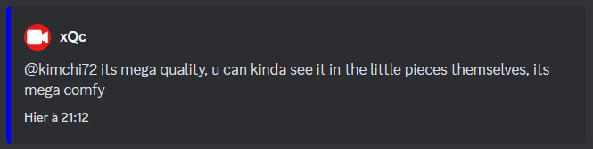

# ChatLog

This is a fork of [Twitch Discord Relay](https://github.com/poespas/twitch-discord-relay), a program that will log messages to Discord sent by certain users in a twitch channel.
Useful for things like streamer setting up their stream, recent updates, etc.
without needing to open the Twitch channel.



## Features

-   Log multiple users inside a twitch channel chat
-   Notify the server when a user sends a message after a while
-   Add a user badge to a specific user so you can quickly identify a user

## How to use

-   Install [Node](http://node.js.org/)
-   Create an extension on the [Twitch Dev page](https://dev.twitch.tv/console/extensions)
-   Fill in config.json (See section Config)
-   Install the packages with: `npm i`
-   Run the code by running:
    `node .`

## Config

```js
{
  "clientID": "xxx", // Client ID of your twitch extension
  "secret": "xxx", // Secret of your twitch extension
  "targetChannel": "xqc", // Twitch channel you want to target
  "notifyAfter": 1800000, // Max amount of time to elapse after @here'ing
  "targetUsers": [
    {
      "username": "xqc", // User to log
      "customBadge": "", // (optional) Badge to display in front of name
      "notice": true, // (optional) Send message when they send a message first time in a long while
      "noticeMessage": "@here xQc is back !" // Specify which message to send on "notice"
    }
  ],
  "webhookUrl": "https://discord.com/api/webhooks/1092150732414795898/38TZP6TRBuYn7qGpHmMurJlvhrv1sz-0OfnxUXeNb1lycHbcBSPbAyOtkGNUAGYU7kEW" // Specify webhook url for discord
}

```
